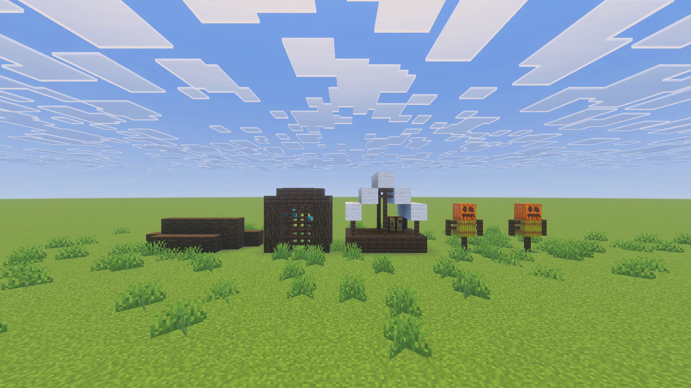

# Pillage Generator

> Created by [Th3Emilis](https://github.com/th3emilis)

  

Build pillager outposts anywhere in your world with the run of a single command. Pillage Generator adds various functions to the game to help you design your own pillager outpost from scratch quickly and easily. Now, go bring more life into your superflat worlds!

## Features

### Individual structures
Build your own pillager outpost, structure by structure.

### Instant pillager outpost
Generate an entire pillager outpost with a single command.

## Usage

In the chat screen, type `/function pg/help` to get a list of all the available functions.

Once you have found the structure you want to generate, make sure you are positioned at the location where you want it to be placed. When choosing the location for the structure, keep in mind that they generate in the cardinal direction your character is facing and to the right. For example, if you are facing east, the structure will generate in the direction where both `X` and `Y` coordinate values increase.

Here are a few functions you can try before digging into all the available options:
- `/function pg/instant_pillager_outpost`: *Generate a prebuilt pillager outpost*
- `/function pg/watchtower`: *Generate a watchtower*
- `/function pg/populate`: *Summon pillagers and a pillager captain for your pillager outpost*

### Using on mobile
Many functions use long names that can get tedious to type on a mobile device after a while. For a better experience, you can use the add-on alongside [Advanchat](https://github.com/th3emilis/advanchat/releases/latest), which allows you to autocomplete commands and access previously run commands easily.

## Terms of Use

By downloading, installing, accessing, using or interacting in any way with this add-on, you agree to be bound by the following terms:
- **Attribution** — You must give proper credit to the creator if you reference, use or feature any of the add-on contents (user interface, files, etc.) in your own content, such as videos, blogs, or social media posts.
- **No Redistribution** — You may not reproduce, redistribute or republish the add-on in any form or by any means. You may not share the direct download link or any user-generated link to the add-on. Use one of the [official links](https://github.com/th3emilis/pillage-generator/blob/main/OFFICIAL_LINKS.md).
- **Non-Commercial** — You may not use the add-on for any commercial or revenue-generating purposes, such as advertising, selling or renting. You may not charge any fees or request any donations for accessing or using the add-on.
- **No Derivates** — You can remix, adapt or build upon the add-on for your own private use, but you may not share, distribute, or make available the modified version of the add-on to any third party. You also agree not to use any part of the add-on (such as files or code snippets) in other add-ons.

## Feedback

For any suggestions, bugs or help, feel free to [join the Discord community](https://discord.gg/skqthyTkBQ).
